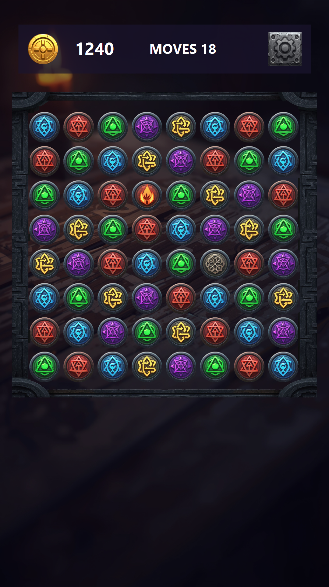
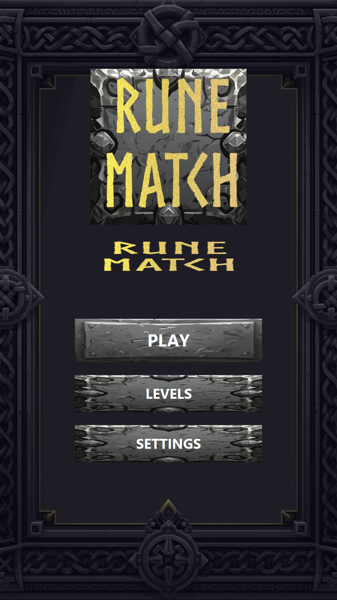
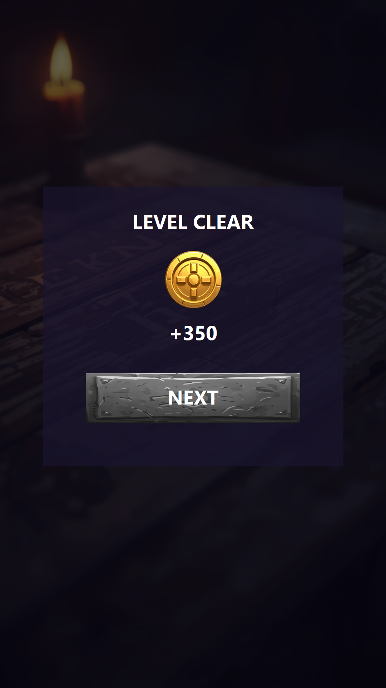
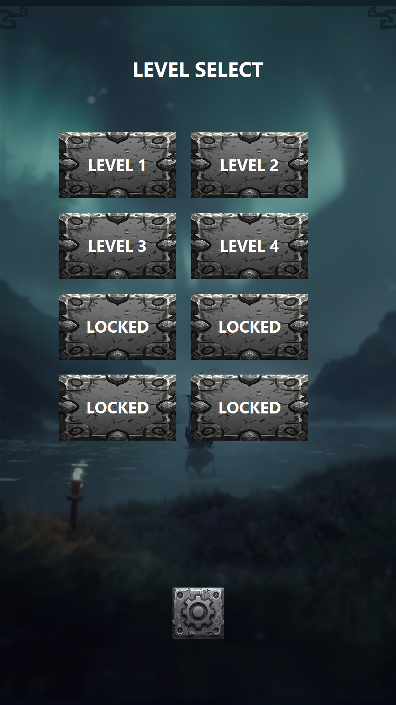

# PocketMatch

Mobile Match-3 prototype built in **Unity 6** to demonstrate live mobile F2P client engineering: async board commands, VContainer service boundaries, Addressables content, Firebase analytics and cloud save, and LevelPlay ad mediation.

> Display name in Player Settings is currently `RuneMatch`. The repository and Android application id use `PocketMatch`.

[](ProjectSettings/ProjectVersion.txt)
[](LICENSE)

<p align="center">
  
</p>

<p align="center">
  
  
  
</p>

## Highlights

- Async command-queued board resolution (swap, destroy, gravity, power tiles)
- Deadlock detection with shuffle-until-playable
- VContainer scopes for bootstrap, menu, and gameplay lifetimes
- Addressables level loading and pooled VFX
- Firebase Analytics with a local offline event queue
- Encrypted local save plus Firestore cloud sync
- Unity LevelPlay banner and interstitial mediation
- Android CI build workflow via GitHub Actions

## Architecture overview

```text
BootstrapLifetimeScope (DontDestroyOnLoad)
  Save / Analytics / Ads / Audio / Input / Firebase bootstrap
        |
        v
Loader -> MainMenu (MenuLifetimeScope)
        |
        v
Loader (optional interstitial gate) -> PlayScene (GameLifetimeScope)
```

Board mutations serialize through `CommandInvoker` and `ICommand` implementations. Live-service hooks enter at bootstrap (analytics/session), level events (start/complete/fail), and Loader transitions (interstitials).

Details: [docs/architecture.md](docs/architecture.md)

## Implemented

- Match-3 core loop, power tiles, level objectives, win/lose flow
- Level select and basic meta (coins, next unlocked level)
- Local + cloud save path, analytics event dictionary, banner + interstitial ads
- Edit Mode tests for potential moves and shuffle

## Not implemented

- In-app purchases, remote config, rewarded ads, Crashlytics
- Full meta progression loop, large level catalog, iOS target

## Tech stack

| Area | Choice |
|------|--------|
| Engine | Unity `6000.3.14f1` (URP 2D) |
| DI | [VContainer](https://github.com/hadashiA/VContainer) |
| Async | [UniTask](https://github.com/Cysharp/UniTask) |
| Content | Addressables (levels, VFX) |
| Auth / cloud save | Firebase Anonymous Auth + Firestore |
| Ads | Unity LevelPlay (IronSource mediation) |
| Analytics | Firebase Analytics (offline queue) |

## Getting started

1. Clone the repository
2. Open in Unity Hub with editor `6000.3.14f1`
3. Press Play — editor bootstrap starts from the Loader flow

Gameplay and local save work without Firebase or LevelPlay. Optional SDK configuration files belong in `Assets/StreamingAssets/` and are excluded from version control.

## Testing

Edit Mode tests in the Unity Test Runner:

- `PotentialMovesTest`
- `ShuffleMatchCountTest`

## Build / CI

Android builds are defined in [`.github/workflows/main.yml`](.github/workflows/main.yml) (push to `master` or manual dispatch). CI expects Unity license secrets configured in the GitHub repository settings.

## Documentation

- [Architecture](docs/architecture.md)
- [Analytics events](docs/analytics-events.md)
- [Third-party attribution](docs/third-party.md)

## License

Original first-party code and docs: [MIT](LICENSE).

Third-party packages and Asset Store plugins keep their own licenses — see [docs/third-party.md](docs/third-party.md).
