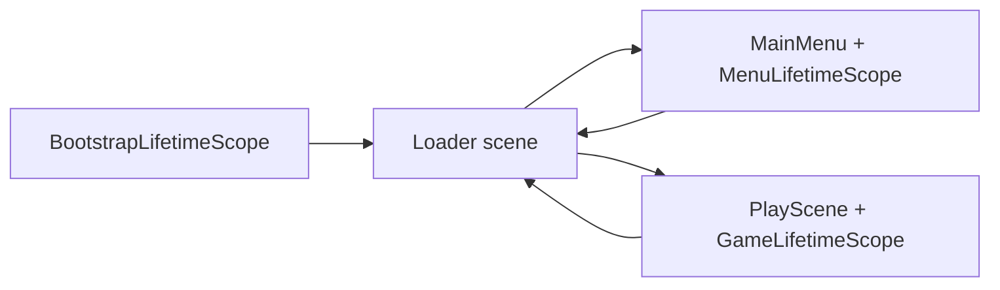

# Architecture

One-page overview of the PocketMatch client.

## Scene and boot flow

Build order:

1. `Loader` — cold-start hub, progress UI, optional interstitial gate
2. `MainMenu` — meta / menu presenters
3. `PlayScene` — Match-3 gameplay

Typical transitions:

```text
Cold start
  -> Loader (bootstrap services live here)
  -> MainMenu
  -> Loader (optional interstitial before gameplay)
  -> PlayScene
  -> Loader (win path may show interstitial)
  -> PlayScene or MainMenu
```

In the Unity Editor, `EditorBootstrapper` forces Play Mode to start from `Loader` when the open scene is in the build list.



## DI scopes

| Scope | Lifetime | Responsibilities |
|-------|----------|------------------|
| `BootstrapLifetimeScope` | `DontDestroyOnLoad` singleton | Save, economy, analytics, input, audio, ads, localization, Firebase bootstrap, cloud-save bootstrap |
| `MenuLifetimeScope` | Main menu scene | Menu presenters and views |
| `GameLifetimeScope` | Play scene | Session, level earnings, continue, HUD, grid presenters, board wiring |

Services register through VContainer with constructor / method injection.

## Core services

| Service | Responsibility |
|---------|----------------|
| `SaveService` | Encrypted local save (`save.dat`), progression updates, cloud upload trigger |
| `EconomyService` | Wallet ledger (`PlayerData.coins`), spend/add, save trigger, balance events |
| `LevelEarningsService` | Per-attempt earnings from gameplay (power tiles, unused-move bonus) |
| `LevelContinueService` | Lose-menu continue gate (once per attempt); applies `ShopOffer` rewards |
| `CloudSaveService` | Anonymous Firebase Auth + Firestore document sync |
| `AnalyticsService` | Firebase Analytics with local offline queue (`analytics_cache.json`) |
| `AdsService` | LevelPlay banner + interstitial mediation |
| `AudioService` | Cue-based SFX |
| `EffectService` | VFX pooling / playback |
| `InputService` | Shared input ticks |

Optional SDK and save configuration load from gitignored files under `Assets/StreamingAssets/`.

## Board command cycle

Board mutations run through an async command queue:

- `ICommand` / `CommandInvoker` serialize `ExecuteAsync` work
- Gameplay commands include `SwapCommand`, `DestroyCommand`, `GravityCommand`, `CreatePowerTileCommand`, and `StaggeredDestroyCommand`
- `GridController` orchestrates match cycles, then asks `BoardStateEvaluator` for potential moves
- Zero potential moves triggers shuffle-until-playable via `GridHelperMethods`

## Ads (current)

| Format | Placement | Behavior |
|--------|-----------|----------|
| Banner | Bottom center | Shown during gameplay when loaded |
| Interstitial | Loader transitions | Gated on next-level continue and similar breaks |

Editor builds simulate interstitial completion. Device builds initialize LevelPlay when local ad configuration is present. Ad failure paths log `ad_skipped` and continue scene flow.

## Save and offline (current)

- Local save is encrypted JSON at `Application.persistentDataPath/save.dat`
- Boot loads local save immediately; cloud sync runs when Firebase is available
- **Conflict policy (no merge):** if a cloud document exists on init download, it replaces in-memory and local disk data. There is no field merge and no last-write-wins comparison yet (`meta.lastSaveTime` is recorded for diagnostics only)
- Upload / init failures leave the local save intact and set `ISaveService.CloudSyncStatus` (shown on the main-menu footer)
- `PlayerData.meta.saveVersion` is the schema version; `SaveService` runs `DataMigrator` when on-disk schema lags `SaveService.CurrentSaveVersion` (today: version bump only)
- Offline play, local save, and analytics queuing continue when network or Firebase is unavailable
- `PlayerData.coins` is the wallet field; all mutations go through `EconomyService` and sync with the full save blob

## Economy (current)

```text
LevelEarningsService (game-scoped, ephemeral)
  -> computes attempt earnings on win
  -> LevelEvents.OnLevelCompleted
EconomyService (bootstrap singleton)
  -> AddCoins on win / TrySpendCoins on purchases
  -> SaveService.Save() (local + cloud when online)
LevelContinueService (game-scoped)
  -> TryContinueWithCoins via ShopOffer asset
  -> LevelManager.GrantExtraMoves (resume without scene reload)
```

| Data | Location |
|------|----------|
| Wallet | `PlayerData.coins` (cloud-synced) |
| Continue offer | `Assets/_Project/Scriptables/Resources/ContinueExtraMoves.asset` (loaded via `Resources.Load("ContinueExtraMoves")`) |
| Attempt earnings | `LevelEarningsService` only; not persisted until win |

Win UI shows coins earned this level; HUD and lose panel show wallet balance (`x N`). Objectives and moves stay visible on fail so the player can judge whether continue is worthwhile.

Continue is once per attempt via coins.

## Live-service hooks

| Hook | Entry point |
|------|-------------|
| Session analytics | `FirebaseInitializer` / `AnalyticsService` during bootstrap |
| Level start / complete / fail | `LevelEvents` → `AnalyticsService` |
| Coins earned | `LevelEvents.OnLevelCompleted` → `EconomyService.AddCoins` → `coins_earned` |
| Coins spent | `EconomyService.TrySpendCoins` → `OnCoinsSpent` → `coins_spent` |
| Lose continue | `LosePresenter` → `LevelContinueService` → `EconomyService` + `LevelManager.GrantExtraMoves` |
| Interstitial gate | `Loader.ShowInterstitialThenContinue` / win path continue |
| Banner | Gameplay HUD / ads service show-hide around interstitials |
| Cloud save | `CloudSaveBootstrap` after bootstrap; upload on local save when online |

## Localization (current)

- Package: `com.unity.localization` with locales `en` (source) and `es`
- Player-facing copy lives in the `UI` String Table Collection (`ui.*` keys); placeholders use indexed `{0}`
- Runtime lookup goes through `ILocalizationService` / `LocalizationService` (bootstrap singleton)
- Static TMP chrome uses `LocalizedTmpLabel`; loader progress text and dynamic HUD/dialog copy also resolve through the same service
- Localization foundation is live: device/system locale, Game View / DebugTools override, and Localizer CSV interchange via **PocketMatch > Localization**
- Empty or missing `es` cells fall back to `en` (no player-facing MISSING text)
- Spanish Locale asset carries **Fallback Locale** metadata pointing at English; String Database **Use Fallback** is enabled
- Startup locale: device/system via Unity selectors, with `en` fallback
- Editor Play Mode: Game View locale dropdown (Unity Localization, on by default)
- Editor tools live under **PocketMatch > Localization** and **PocketMatch > Debug** (single top-level menu)
- Localizer interchange: Unity String Table CSV only. Export/import via **PocketMatch > Localization** menus (`Assets/Localization/Export/{TableCollectionName}.csv`). Catalog JSON stays out of this repo.

Create or refresh assets with **PocketMatch > Localization > Create Foundation**.

## Related docs

- [Analytics events](analytics-events.md)
- [Third-party attribution](third-party.md)
