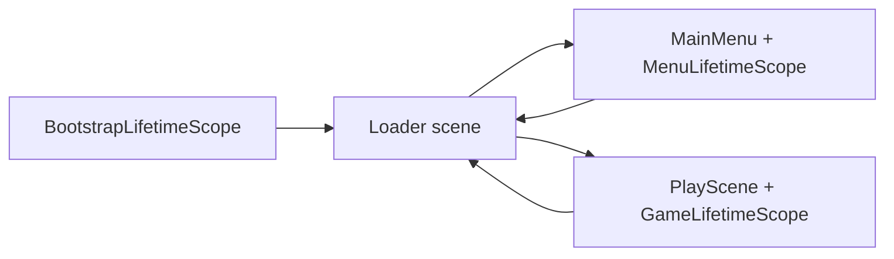

# Architecture

One-page overview of the PocketMatch client.

## Scene and boot flow

Build order:

1. `Loader` — cold-start hub, progress UI, optional interstitial gate
2. `MainMenu` — meta / menu presenters
3. `PlayScene` — Match-3 gameplay

Typical transitions:

```text
Cold start
  -> Loader (bootstrap services live here)
  -> MainMenu
  -> Loader (optional interstitial before gameplay)
  -> PlayScene
  -> Loader (win path may show interstitial)
  -> PlayScene or MainMenu
```

In the Unity Editor, `EditorBootstrapper` forces Play Mode to start from `Loader` when the open scene is in the build list.



## DI scopes

| Scope | Lifetime | Responsibilities |
|-------|----------|------------------|
| `BootstrapLifetimeScope` | `DontDestroyOnLoad` singleton | Save, analytics, input, audio, ads, Firebase bootstrap, cloud-save bootstrap |
| `MenuLifetimeScope` | Main menu scene | Menu presenters and views |
| `GameLifetimeScope` | Play scene | Session, score, HUD, grid presenters, board wiring |

Services register through VContainer with constructor / method injection.

## Core services

| Service | Responsibility |
|---------|----------------|
| `SaveService` | Encrypted local save (`save.dat`), progression updates, cloud upload trigger |
| `CloudSaveService` | Anonymous Firebase Auth + Firestore document sync |
| `AnalyticsService` | Firebase Analytics with local offline queue (`analytics_cache.json`) |
| `AdsService` | LevelPlay banner + interstitial mediation |
| `AudioService` | Cue-based SFX |
| `EffectService` | VFX pooling / playback |
| `InputService` | Shared input ticks |

Optional SDK and save configuration load from gitignored files under `Assets/StreamingAssets/`.

## Board command cycle

Board mutations run through an async command queue:

- `ICommand` / `CommandInvoker` serialize `ExecuteAsync` work
- Gameplay commands include `SwapCommand`, `DestroyCommand`, `GravityCommand`, `CreatePowerTileCommand`, and `StaggeredDestroyCommand`
- `GridController` orchestrates match cycles, then asks `BoardStateEvaluator` for potential moves
- Zero potential moves triggers shuffle-until-playable via `GridHelperMethods`

## Ads (current)

| Format | Placement | Behavior |
|--------|-----------|----------|
| Banner | Bottom center | Shown during gameplay when loaded |
| Interstitial | Loader transitions | Gated on next-level continue and similar breaks |

Editor builds simulate interstitial completion. Device builds initialize LevelPlay when local ad configuration is present. Ad failure paths log `ad_skipped` and continue scene flow.

## Save and offline (current)

- Local save is encrypted JSON at `Application.persistentDataPath/save.dat`
- Boot loads local save immediately; cloud sync runs when Firebase is available
- If a cloud document exists on init, it replaces local data (no merge UI)
- Offline play, local save, and analytics queuing continue when network or Firebase is unavailable

## Live-service hooks

| Hook | Entry point |
|------|-------------|
| Session analytics | `FirebaseInitializer` / `AnalyticsService` during bootstrap |
| Level start / complete / fail | `LevelEvents` → `AnalyticsService` |
| Interstitial gate | `Loader.ShowInterstitialThenContinue` / win path continue |
| Banner | Gameplay HUD / ads service show-hide around interstitials |
| Cloud save | `CloudSaveBootstrap` after bootstrap; upload on local save when online |

## Related docs

- [Analytics events](analytics-events.md)
- [Third-party attribution](third-party.md)
